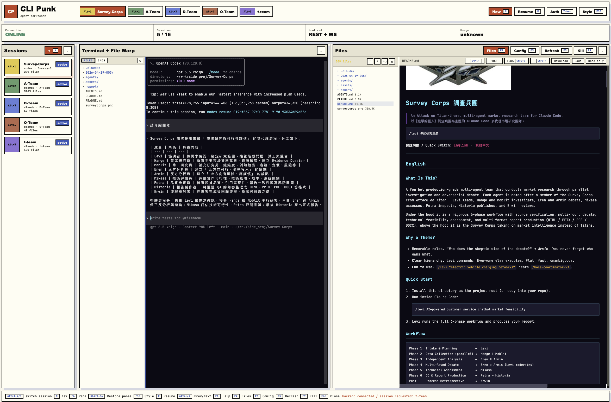

# CLI Punk



Web-based local workbench for running Claude Punk sessions. The app uses a Node.js backend for PTY sessions, file operations, auth, REST, and WebSocket protocol handling, plus a browser UI for terminal, file, activity, and config workflows.

The backend is required runtime infrastructure. The CLI package is kept for supporting commands and an experimental TUI, but the recommended product surface is the web app.

## Requirements

- Node.js 20 or newer
- npm
- `claude` and/or `codex` installed on your `PATH` if you want sessions to auto-launch those agents

## Install

```bash
npm install
```

## Start The Web App

Run the web app with the backend:

```bash
npm start
```

The default backend URL is `http://127.0.0.1:3000`. The default web URL is `http://127.0.0.1:5173`.

To keep the browser closed during startup:

```bash
NO_OPEN=1 npm start
```

The startup script launches `backend/server.js`, waits for `/health`, then starts the Vite web frontend.

## Auth Token Placement

Use repo-root `.env` as the canonical local place for the backend admin token:

```bash
CLAUDE_PUNK_ADMIN_TOKEN=replace-with-a-high-entropy-local-token
```

The backend accepts `CLAUDE_PUNK_ADMIN_TOKEN` from, in order:

1. `CLAUDE_PUNK_ENV_FILE`, when that env var points at an explicit dotenv file.
2. `backend/.env`, then repo-root `.env`; repo-root `.env` wins when both define the same auth key.
3. The shell environment, only when the selected dotenv files do not define the auth key.

The web page does not read backend `.env` directly. Paste the same token into the web Auth panel, or store it with the CLI login command below. `CLAUDE_PUNK_TOKEN` and `VITE_CLAUDE_PUNK_TOKEN` only tell a client what bearer token to send; setting either one alone does not make the backend accept that token.

Useful environment variables:

```bash
PORT=3000
FRONTEND_PORT=5173
NO_OPEN=1
CLAUDE_PUNK_ADMIN_TOKEN=change-this-local-token
CLAUDE_PUNK_ALLOWED_ORIGINS=http://127.0.0.1:5173
CLAUDE_PUNK_AUTH_DIR="$HOME/.claude-punk"
```

## CLI Support

Store a backend URL and bearer token:

```bash
npm --workspace cli start -- login --server http://127.0.0.1:3000 --token "$CLAUDE_PUNK_ADMIN_TOKEN"
```

Common commands:

```bash
npm --workspace cli start -- whoami
npm --workspace cli start -- session list
npm --workspace cli start -- session create /path/to/project --agent claude
npm --workspace cli start -- token create --name local-operator --role operator
```

## TUI Status

The TUI under `cli/src/tui/` is experimental and is not the primary product surface. It still depends on the backend REST/WebSocket runtime, so it is better understood as a terminal frontend rather than a standalone CLI.

The script remains available for development:

```bash
npm run dev:tui
```

## Tests

```bash
npm test
```

This runs backend, frontend, and CLI tests through npm workspaces.

## Project Layout

```text
backend/   Required REST, WebSocket, auth, PTY session, and file runtime
frontend/  Primary browser UI
cli/       Supporting CLI commands and experimental TUI
scripts/   Web/backend startup orchestration
```

Local planning notes, reference snapshots, agent configs, and worklogs are intentionally ignored by Git and kept only on the developer machine.
